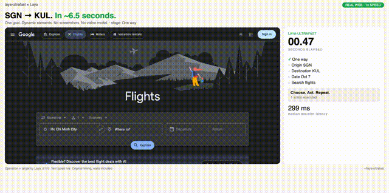

# laya-ultrafast ⚡

**A browser agent with a dynamic, indexed action space — powered by a local
decision model instead of a cloud API.**

Inspired by [browser-use/jev-ultrafast](https://github.com/browser-use/jev-ultrafast):
same loop, same questions, same validation — but the Jev API call is swapped
for **[Laya](https://brainfunctioncollapse.com/laya)**, running on your own
GPU for $0.

**SGN → KUL on Google Flights in ~6.5 seconds.** One natural-language goal,
actual text generation, and loading waits included.

<a href="docs/demo.mp4"></a>

[Watch the MP4](docs/demo.mp4) · [Read the loop](laya_ultrafast/laya_agent.py)

## The action space

Every observation produces a new element table:

```text
[1] combobox  Where from?        · Ho Chi Minh City
[2] combobox  Where to?          · empty
[3] textbox   Departure          · empty
[4] button    Search flights
...
```

```text
                      one Laya request (:8770)
                     ┌───────────────────────────┐
page → element table → operation                 │
                     │ click_target              │
                     │ type_text_target          │
                     └─────────────┬─────────────┘
                         use the matching target
                                   │
                    CLICK [4] ─────┤──→ browser
                TYPE_TEXT [2] ─────┘
                          ↓
                   small LLM → text → browser
```

Target questions are speculative. If the operation is `CLICK`, only
`click_target` can execute. Two decisions, **one local round trip**
(~100–190ms, $0). Laya needs ≥2 options per choice, so single-candidate
heads get a `[0] none of the above` pad stripped before validation.

**Shortlist → batch → rerank.** Laya degrades past ~10 options per choice
(measured 0.46/0.21/0.20/0.14 on 4 similar links), so big pages never reach
it whole: code pre-filters to ≤10 per batch, batch winners advance, one
final rerank over the top-3. See `shortlist()` + `choose()` in `laya_model.py`.

## Try it (model stays local — we ship setup, not weights)

```bash
git clone https://github.com/xuancuongdoo/laya-ultrafast.git
cd laya-ultrafast
uv sync
cp .env.example .env
# Laya needs no key. Add TEXT_MODEL_API_KEY for field text only.
uv run laya-ultrafast
```

Open **http://127.0.0.1:8766** and enter a goal. **Choose + act** pauses
before execution. First, start Laya itself (weights download once, stay local):

```bash
uv pip install laya
python -m laya serve --port 8770
```

## Proof vs jev-ultrafast

|  | jev-ultrafast | laya-ultrafast |
|---|---|---|
| Decision model | Jev API (cloud, $) | Laya :8770 (local, $0) |
| Decision latency | ~143–164ms median | ~100–190ms measured |
| Options per choice | up to 255 | ≤10 (batched + reranked) |
| Operation head | reliable | weak — code forces op, Laya picks target |
| Text | mercury-2.5 | any OpenAI-compatible small model |

Honest limits (all measured, see video): the operation head bails to DONE
on big pages and TYPE_TEXT never wins on its own — so the harness routes the
operation in code and asks Laya *which* target. Laya shines as guard / judge /
router, not as a drop-in click-picker.

## Files

| File | Job |
|---|---|
| `laya_model.py` | `choose()` (shortlist→batch→rerank), `field_text()`, validation |
| `laya_agent.py` | observe–decide–act loop with budgets |
| `laya_browser.py` | CDP browser, commit-time validation |
| `snapshot.js` | atomic DOM snapshot (unchanged from upstream) |
| `questions.py` | `NEXT_ACTION` / `TARGET` / `TEXT_VALUE` prompt pack |
| `examples/flight_search.py` | the SGN→KUL demo from the video |
